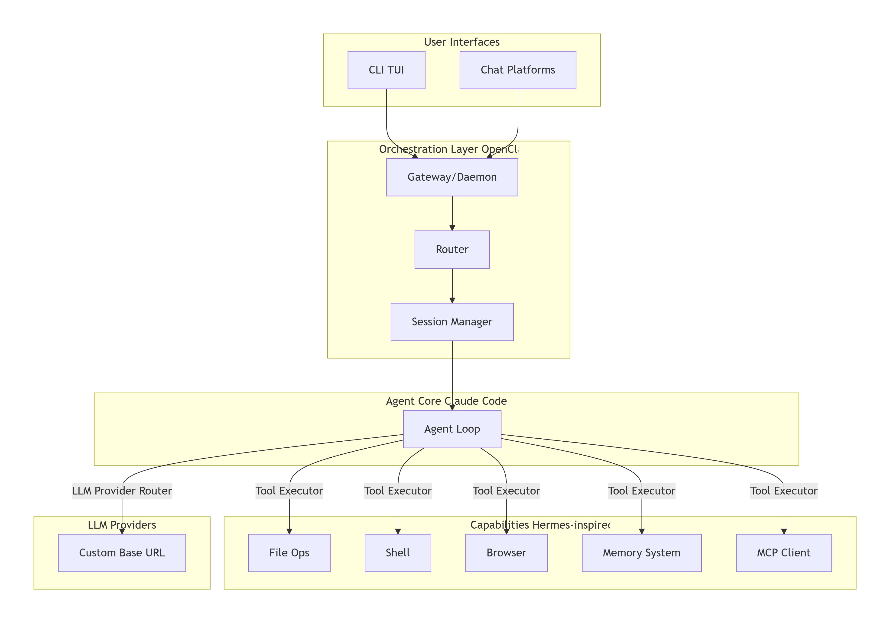

# STRAK AGENT - AI Agent with 200+ Tools

<div align="center">


**Powerful AI Agent CLI with Cyberpunk UI & 200+ Automation Tools**

[](LICENSE)
[](https://www.typescriptlang.org/)
[](https://nodejs.org/)

[Features](#-features) • [Installation](#-quick-start) • [Usage](#-usage) • [Tools](#-tools-200) • [Documentation](#-documentation)

</div>

---

## Features

- **🧠 Smart Structure Thinking** - Visual AI planning with mind maps (Ctrl+S)
- **🎨 Cyberpunk UI** - Beautiful terminal interface with animations
- **🛠️ 200+ Tools** - File operations, web search, git, media, automation, etc.
- **🤖 AI-Powered** - Intelligent agent loop with tool calling
- **⚡ Parallel Execution** - Run 5-8 tools simultaneously (5-8x speed)
- **🔐 Tool Approval** - Interactive approval with auto-approve option
- **💡 Tool Suggestion** - Type `/` for autocomplete
- **🔗 MCP Support** - Compatible with Claude Code MCP servers (84+ extra tools)
- **💾 Memory System** - Save and recall important information
- **🔍 Web Search** - Integrated LangSearch API (95% accuracy, 100ms response)
- **📁 File Management** - Read, write, edit files easily
- **🎯 Rotating Tool Tips** - Learn tools every 6 seconds

---

## Quick Start

### Installation

```bash
# 1. Clone repository
git clone https://github.com/rasyaathaya7212-eng/strak
cd strak

# 2. Install dependencies
npm install

# 3. Build project
npm run build

# 4. Link globally
npm link
```

### Configuration

Edit `config.json`:

```json
{
  "apiKey": "YOUR_API_KEY",
  "baseUrl": "https://your-api-endpoint.com/v1",
  "model": "your-model-name"
}
```

### Run

```bash
strak
```

---

## Usage

### Basic Commands

```bash
# Start STRAK
strak

# Normal chat
┃ ▶ Hello

# Use tool suggestion
┃ ▶ /web_search
> Search for Bitcoin price today

# Automated task
┃ ▶ Read file package.json and create summary

# View detailed results
┃ ▶ details

# Exit
┃ ▶ exit
```

### Keyboard Shortcuts

- **Ctrl+S** - Toggle Smart Structure Thinking Mode
- **Ctrl+O** - Toggle detailed results panel
- **Type `details`** - Show full tool outputs

### 🧠 Smart Structure Thinking Mode

Press **Ctrl+S** to enable visual planning mode. AI will:

1. **Create a detailed plan** before executing any tools
2. **Display the plan** at `http://localhost:3737` with interactive visualization
3. **Update in real-time** as tools execute (planned → in-progress → completed/failed)
4. **Export plans** as JSON for future sessions

**When enabled, you'll see:**
```
⚡ SMART STRUCTURE ACTIVE (bottom right corner)
```

**Visual Planning:**
- Mind map with connected nodes showing task hierarchy
- Color-coded status: Yellow (planned), Blue (in-progress), Green (completed), Red (failed)
- Click nodes to see details
- Export button to save plan as JSON

**Use cases:**
- Complex multi-step tasks
- Understanding AI's reasoning
- Reusing successful thinking patterns
- Teaching AI your workflow

### Tool Suggestion Feature

Type `/` to view all tools:

1. Type `/` or `/tool_name` (partial match)
2. Select a tool using the arrow keys ↑↓
3. Press Enter to confirm
4. Enter your task
5. The AI ​​will use the tool (as a suggestion)
**Example:**
```
┃ ▶ /web
? Pilih tool:
  ❯ web_search
    web_fetch
    web_search_news
    web_extract
? Apa yang ingin Anda lakukan?
┃ ▶ Cari harga emas hari ini
```

---

## Tools (200+)

### Implemented Tools (14)

| Tool | Description | Category |
|------|-------------|----------|
| `read_file` | Read file with line numbers | Filesystem |
| `write_file` | Write/overwrite file | Filesystem |
| `read` | Read file (Claude style) | Filesystem |
| `write` | Create/overwrite file | Filesystem |
| `ls` | List directory | Filesystem |
| `terminal` | Execute shell command | Terminal |
| `bash` | Run bash command | Terminal |
| `web_search` | Search web (LangSearch API) | Web |
| `web_fetch` | Fetch URL content | Web |
| `memory_save` | Save to memory | Memory |
| `memory_recall` | Read from memory | Memory |
| `canvas_present` | Create HTML canvas/dashboard | Skills |
| `canvas_snapshot` | Archive canvas as HTML/MD | Skills |
| `canvas_eval` | Analyze canvas content | Skills |

### 🔗 MCP (Model Context Protocol) Support

STRAK supports MCP servers for extended capabilities. Configure in `.strak/mcp.json`:

```json
{
  "mcpServers": {
    "tradingview": {
      "command": "npx",
      "args": ["-y", "@kevinslin/tradingview-mcp@latest"],
      "disabled": false,
      "autoApprove": []
    }
  }
}
```

**Currently connected:** TradingView MCP (84 trading analysis tools)

### All Categories (15)

<details>
<summary><b>Filesystem (25 tools)</b></summary>

- File operations: read, write, edit, delete
- Directory management: ls, mkdir, rmdir
- File info: metadata, hash, permissions
- Advanced: patch, merge, diff, split

</details>

<details>
<summary><b>Terminal & Execution (18 tools)</b></summary>

- Command execution: bash, powershell, ssh
- Process management: monitor, kill, list
- Package management: install, update
- Testing: run tests, linter, formatter

</details>

<details>
<summary><b>Web & Search (22 tools)</b></summary>

- Search engines: web_search, news search
- Browser automation: navigate, click, type
- Content extraction: fetch, scrape, screenshot
- URL utilities: metadata, status, download

</details>

<details>
<summary><b>Text Processing (15 tools)</b></summary>

- Text operations: grep, sed, awk
- Line manipulation: sort, unique, count
- Format validation: JSON, YAML, Markdown

</details>

<details>
<summary><b>Agent & Delegation (12 tools)</b></summary>

- Sub-agents: spawn, delegate, team
- Session management: list, get, status
- Task management: create, list, wait

</details>

<details>
<summary><b>Memory & Context (10 tools)</b></summary>

- Memory: save, recall, search
- Context: inject files/URLs
- Checkpoints: create, rollback

</details>

<details>
<summary><b>Git & Version Control (12 tools)</b></summary>

- Basic: status, commit, log, diff
- Branching: branch, checkout, merge
- Remote: pull, push, clone

</details>

<details>
<summary><b>Media & Image (12 tools)</b></summary>

- Image: generate, analyze, resize, crop
- Audio: TTS, STT
- PDF: read, merge

</details>

<details>
<summary><b>Automation (10 tools)</b></summary>

- Scheduling: cronjob, schedule
- TODO management
- Batch processing, webhooks

</details>

<details>
<summary><b>Communication (10 tools)</b></summary>

- Email: send, read (SMTP/IMAP)
- Messaging: Slack, Discord, Telegram
- Social: WhatsApp, Matrix, IRC

</details>

<details>
<summary><b>Data & Calculation (12 tools)</b></summary>

- Math: calculator, date/time
- Parsing: JSON, CSV, YAML
- Encoding: base64, hash, UUID

</details>

<details>
<summary><b>Integration (15 tools)</b></summary>

- MCP: tool calling, resources
- Home Assistant integration
- Notion, GitHub, Jira APIs
- Database queries

</details>

<details>
<summary><b>Skills & Plugins (10 tools)</b></summary>

- Skills management
- Plugin system
- Canvas presentation

</details>

<details>
<summary><b>Device & UI (17 tools)</b></summary>

- Device management
- Screen capture, UI theme
- Archive: ZIP, TAR, GZIP
- System: disk usage, checksum

</details>

---

## Documentation

- [Installation Guide](GITHUB_SETUP.md) - Detailed setup instructions
- [Architecture](ARCHITECTURE.md) - System design & structure
- [Contributing](CONTRIBUTING.md) - How to contribute
- [Changelog](CHANGELOG.md) - Version history

---

## Architecture

**STRAK** menggunakan **Chimera Architecture** yang menggabungkan:



**Key Components:**
- **CLI Layer** - Inquirer-based interactive terminal
- **Gateway** - Routes requests, manages sessions
- **Agent Loop** - Iterative LLM + tool execution (max 10 iterations)
- **LLM Router** - Custom provider support (any OpenAI-compatible API)
- **Tool System** - 200+ tools across 14 categories + unlimited MCP tools
- **MCP Integration** - Compatible dengan Claude Code MCP servers

---

## Use Cases

### 1. **Research Assistant**
```
┃ ▶ Cari 5 artikel terbaru tentang quantum computing, 
    rangkum poin penting, dan simpan ke research.md
```

### 2. **Development Helper**
```
┃ ▶ Baca file package.json, list semua dependencies, 
    cek versi terbaru, dan buat laporan
```

### 3. **Data Processing**
```
┃ ▶ Baca data.csv, filter rows dengan status "active",
    convert ke JSON, dan simpan ke output.json
```

### 4. **Automation**
```
┃ ▶ Setiap hari jam 9 pagi, cari berita tech terbaru
    dan kirim summary via email
```

---

## Contributing

Contributions are welcome! 

1. Fork the repository
2. Create feature branch: `git checkout -b feature/amazing-feature`
3. Commit changes: `git commit -m 'Add amazing feature'`
4. Push to branch: `git push origin feature/amazing-feature`
5. Open Pull Request

See [CONTRIBUTING.md](CONTRIBUTING.md) for details.

---

## Known Issues

- Banyak tools masih stub (dalam development)
- Token context limit belum optimal
- Rate limiting belum diimplementasi
- Error recovery perlu improvement

---

## Roadmap

- [x] Basic CLI interface
- [x] 200 tool structure
- [x] Tool suggestion with `/`
- [x] Auto-config copy
- [ ] Implement remaining tools
- [ ] Add streaming response
- [ ] Multi-agent orchestration
- [ ] Plugin system
- [ ] Web UI dashboard

---

## License

MIT License - see [LICENSE](LICENSE) file for details.

---

## Credits

**STRAK AGENT** is inspired by and combines best practices from:

- [Claude Code](https://www.anthropic.com) - Tool calling patterns
- [OpenClaw](https://github.com/openclaw) - Agent orchestration
- [Hermes](https://github.com/hermes-ai) - Advanced capabilities

Built with:
- TypeScript + Node.js
- Inquirer (CLI)
- Chalk (Colors)
- Axios (HTTP)
- Zod (Validation)

---

## Contact

- GitHub Issues: [Create an issue](https://github.com/USERNAME/strak-agent/issues)
- Email: ambatukam.blewww@gmail.com
- Tiktok: STRAK AGENT

<div align="center">

**Made by AI AND ME**

Star this repo if you find it useful! Thanks

</div>
